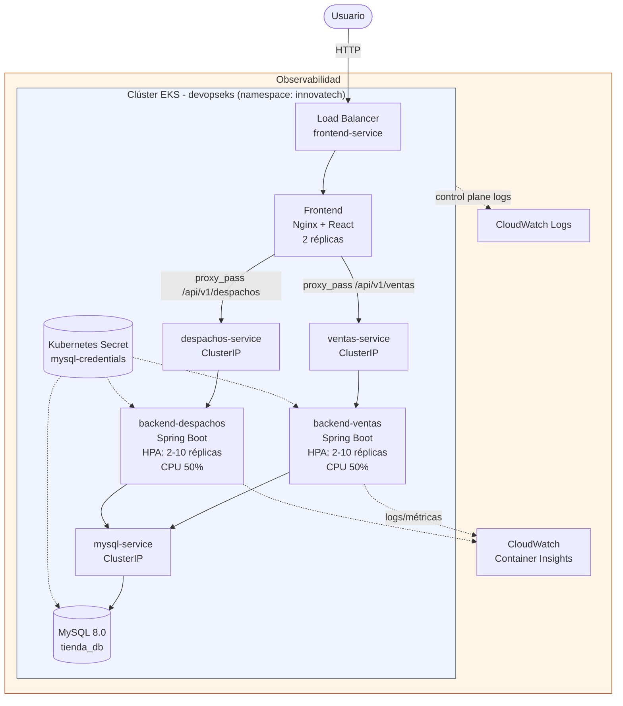
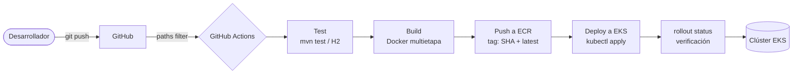

# Innovatech — Plataforma de Ventas y Despachos

Sistema de gestión de ventas y despachos para Innovatech Chile, compuesto por un frontend en React, dos microservicios backend en Spring Boot (Ventas y Despachos), y una base de datos relacional MySQL. Todo el ciclo de integración y despliegue está automatizado con GitHub Actions, y el sistema se orquesta en producción sobre Amazon EKS.

## Índice

- [Arquitectura](#arquitectura)
- [Stack tecnológico](#stack-tecnológico)
- [Desarrollo local (Docker Compose)](#desarrollo-local-docker-compose)
- [Despliegue en la nube (AWS EKS)](#despliegue-en-la-nube-aws-eks)
- [CI/CD](#cicd)
- [Configuración y secretos](#configuración-y-secretos)
- [Observabilidad](#observabilidad)
- [Seguridad](#seguridad)
- [Estructura del repositorio](#estructura-del-repositorio)

## Arquitectura

El sistema sigue una arquitectura de microservicios contenedorizados, con el frontend actuando como reverse proxy hacia los backends internos — solo el frontend está expuesto a Internet.



### Flujo de CI/CD



## Desarrollo local (Docker Compose)

Requisitos: Docker Desktop instalado y corriendo.

```bash
cp .env.example .env
# edita .env con tus credenciales locales
docker-compose up --build
```

Accede en [http://localhost](http://localhost).

Servicios expuestos localmente:
- Frontend: `http://localhost`
- Backend Ventas: `http://localhost:8080`
- Backend Despachos: `http://localhost:8081`
- MySQL: `localhost:3306`

Para detener:
```bash
docker-compose down
```

## Despliegue en la nube (AWS EKS)

### 1. Crear el clúster

```bash
eksctl create cluster -f infra/cluster.yaml
aws eks update-kubeconfig --region us-east-1 --name devopseks
```

### 2. Crear el namespace y el Secret de base de datos

```bash
kubectl apply -f k8s/namespace.yaml

kubectl create secret generic mysql-credentials \
  --namespace=innovatech \
  --from-literal=DB_USERNAME=root \
  --from-literal=DB_PASSWORD='' \
  --from-literal=DB_NAME=tienda_db
```

### 3. Desplegar MySQL

```bash
kubectl apply -f k8s/db.yaml
```

### 4. Los backends y el frontend se despliegan automáticamente vía GitHub Actions

Al hacer `git push` a `main`, los pipelines correspondientes construyen, prueban, publican en ECR y despliegan en EKS automáticamente (ver sección [CI/CD](#cicd)).

Para desplegar manualmente (bootstrap inicial o depuración):
```bash
kubectl apply -f k8s/ventas.yaml
kubectl apply -f k8s/despachos.yaml
kubectl apply -f k8s/front.yaml
```

### 5. Obtener la URL pública

```bash
kubectl get svc frontend-service -n innovatech
```

## CI/CD

Tres pipelines independientes en `.github/workflows/`, cada uno disparado solo por cambios en su carpeta correspondiente (`paths` filter):

- `cicd-ventas.yml` → `back-Ventas_SpringBoot/**`
- `cicd-despachos.yml` → `back-Despachos_SpringBoot/**`
- `cicd-front.yml` → `front_despacho/**`

Cada pipeline ejecuta, en orden:

1. **Test**: `mvn test` contra una base de datos H2 en memoria (perfil `test`), sin depender de infraestructura externa.
2. **Build**: imagen Docker multietapa (build con Maven/Node, runtime minimalista sobre `eclipse-temurin:17-jdk-alpine` / `nginx:alpine`).
3. **Push a ECR**: cada imagen se etiqueta con el SHA del commit (`${{ github.sha }}`) además de `latest`, para trazabilidad completa entre código e imagen desplegada.
4. **Deploy a EKS**: `kubectl apply` sobre el manifest correspondiente, con la imagen actualizada al tag del commit actual.
5. **Verificación de rollout**: `kubectl rollout status --timeout=120s`, que falla explícitamente el pipeline si el nuevo pod no llega a `Running` — evita falsos positivos de "pipeline verde" con un despliegue roto.
## Observabilidad

- **Logs del pipeline**: disponibles en la pestaña Actions de GitHub, con cada etapa (test, build, push, deploy, rollout) como paso independiente y auditable.
- **Logs del control plane de EKS**: habilitados en CloudWatch Logs (`/aws/eks/devopseks/cluster`), cubriendo API server, audit, authenticator, controller manager y scheduler.
- **Métricas de aplicación**: CloudWatch Container Insights, desplegado como DaemonSet (`cloudwatch-agent` + `fluentd-cloudwatch`) en el namespace `amazon-cloudwatch`, recolectando CPU/memoria de pods y nodos.
- **Logs de aplicación en tiempo real**: `kubectl logs -f deployment/<nombre> -n innovatech`.
- **Estado del autoscaling**: `kubectl get hpa -n innovatech` (umbral CPU 50%, min 2 / max 10 réplicas por backend).

## Seguridad

- Imágenes base minimalistas (`alpine` para Nginx y runtime de Java) para reducir superficie de ataque.
- Solo el frontend está expuesto públicamente (`LoadBalancer`); los backends y la base de datos son `ClusterIP`, alcanzables únicamente desde dentro del clúster.
- Credenciales de base de datos gestionadas vía Kubernetes Secrets.
- Health probes (`readinessProbe`/`livenessProbe`) en ambos backends, para que Kubernetes deje de enviar tráfico a instancias no saludables antes de reiniciarlas.
- `.dockerignore` en los 3 componentes, evitando incluir `node_modules`, `target/`, archivos `.env` o el historial de git dentro de las imágenes.

## Estructura del repositorio

```
devOps/
├── front_despacho/              # Frontend React + Nginx
│   ├── Dockerfile
│   ├── nginx.conf.template
│   └── .dockerignore
├── back-Ventas_SpringBoot/      # Backend de Ventas (Spring Boot)
├── back-Despachos_SpringBoot/   # Backend de Despachos (Spring Boot)
├── k8s/                         # Manifests de Kubernetes
│   ├── namespace.yaml
│   ├── db.yaml
│   ├── db-secret.example.yaml
│   ├── ventas.yaml
│   ├── despachos.yaml
│   └── front.yaml
├── infra/
│   └── cluster.yaml             # IaC del clúster EKS (eksctl)
├── .github/workflows/           # Pipelines CI/CD
│   ├── cicd-ventas.yml
│   ├── cicd-despachos.yml
│   └── cicd-front.yml
├── docker-compose.yml           # Orquestación local
├── .env.example
└── README.md
```
